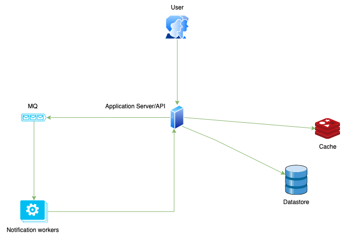

# sl-monitor [](https://github.com/adikm/sl-monitor/actions/workflows/github-ci.yml)

Storstockholms Lokaltrafik train monitor

This application serves API that allows to get information about Stockholm's region train traffic.
One can create and schedule notifications that inform about departures from chosen station and potential disturbances,
if there are any.

### Prerequisites

The only prerequisite is Docker installed on your machine. Also you should get TrafikVerket API key.

### Architecture diagram



### Terraforming Google Cloud Platform

Remember to login to GCP

```shell
gcloud auth application-default login
```

before running

```shell
terraform init
terraform apply
```

To synchronize with remote infrastructure, run:

```shell
export PROJECT_ID=slmonitor
terraform import module.project_services.google_project_service.project_services "oslogin.googleapis.com"
terraform import module.project_services.google_project_service.project_services "compute.googleapis.com"

terraform import google_compute_network.vpc_network $PROJECT_ID-network
terraform import google_compute_firewall.allow_ssh allow-ssh    
terraform import google_compute_address.static_ip $PROJECT_ID-instance
terraform import google_compute_instance.vm_instance $PROJECT_ID-instance
terraform import google_sql_database_instance.postgresql $PROJECT_ID-db1
terraform import google_sql_database.postgresql_db $PROJECT_ID/$PROJECT_ID-db1/$PROJECT_ID
terraform import google_sql_user.postgresql_user $PROJECT_ID/$PROJECT_ID-db1/postgres
terraform import google_redis_instance.$PROJECT_ID_cache $PROJECT_ID
terraform import google_container_registry.registry $PROJECT_ID
terraform import google_cloud_run_service.run_service locations/europe-central2/namespaces/$PROJECT_ID/services/$PROJECT_ID
terraform import google_cloud_run_service_iam_member.run_all_users "projects/$PROJECT_ID/locations/europe-central2/services/$PROJECT_ID roles/run.invoker allUsers"

```

### Local running

1. Open [config.yml](config.yml) and configure environment variables as stated in the file.
   Optionally you can pass the variables directly to the _run_ command. If you wish to do so, skip this step.
2. Build local docker image: ```make build-deploy```
3. Run docker-compose

```shell
make run-deploy
```

optionally pass additional variables:

```shell 
env TRAFFIC_API_AUTH_KEY=value env MAIL_USERNAME=user env MAIL_PASSWORD=pass make run-deploy
```

All the services will start and the application should be accessible under the following
link: ```http://localhost:4444```